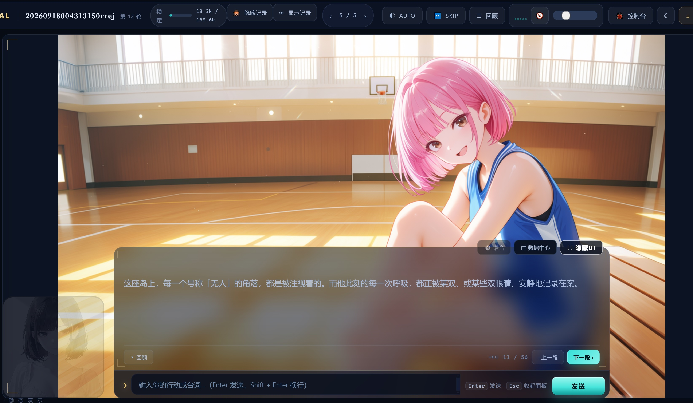

# AI-GAL

**AI-GAL** 是一个完全本地运行的 AI 角色扮演 / 视觉小说（Galgame）引擎。
用 SillyTavern 生态的角色卡驱动多角色剧情：主 AI 写故事，管家 AI 负责格式切分与氛围分析，
画师 AI 撰写生图提示词，配合 ComfyUI 自动生成立绘与 CG，
支持 TTS 语音朗读、MVU 变量系统、世界书、多存档管理与移动端自适应界面。

后端 Node.js + Express + SQLite（better-sqlite3），前端为原生 JS 游戏化 UI，无需构建、解压即用。



---

## 一、功能特性

### 角色扮演与剧情
- **SillyTavern 兼容角色卡**：支持 `.json` 与 PNG 内嵌卡导入；内置角色卡优化助手（格式规范 / 去重合并）
- **三个 AI 分工流水线**：主 AI 生成剧情（### story / dialog / status / actions 分段），管家 AI 完成
  氛围（mood）分析、行动选项生成、记忆摘要、生图触发判断，画师 AI 撰写生图提示词（详见第二节）
- **世界书**：关键词 / 常驻 / 关闭三种激活模式，见 `WORLDBOOK_ACTIVATION_GUIDE.md`
- **MVU 变量卡兼容**：支持 `<UpdateVariables>`、JSONPatch、SAM 等变量系统，内置世界状态检视器
- **STscript 兼容**：脚本命令与脚本变量（全局 / 会话级）
- **记忆代理**：每轮生成一句记忆摘要，累计后自动整理成表格注入上下文，长对话不丢剧情

### 视觉与音频
- **ComfyUI 自动生图**：（注：请一定要安装ComfyUI以确保游戏体验）主要功能：角色立绘（portrait）、剧情 CG、角色登场 CG、头像；
  提示词标签按双层结构（Hard Tags + 自然语言）自动组合
- **TTS 语音朗读**：支持火山引擎、阿里百炼、SiliconFlow、Volink 等云端 API 格式，
  以及 ComfyUI Qwen3-TTS（`qwen3-tts-01.json`）本地推理
- **BGM 氛围联动**：按管家 AI 判定的 mood（battle / blue / ceremony / nomal / relaxed / suspense）自动切歌，
  仓库自带 15 首曲目（12 首 CC-BY 4.0 + 3 首自制 / AI 生成），开箱即用
- **主题系统**：内置多套主题 + 自定义 CSS 变量

### 存档与界面
- **master/sub 存档架构**：按角色分文件夹，存档内含事件日志、角色名册、CG 画廊、生成图片
- **多端界面**：桌面全屏 VN 演出界面 + 手机 / 平板移动端（自动识别跳转，可用 `?desktop=1` 切回）
- **局域网游玩**：`Start-LAN.bat` 启动后，同一网络下的手机可直接访问

---

## 二、AI 分工与模型选择

本项目把「写故事」与「结构化杂活」拆给三个**可独立配置**的 AI（在 **设置 → API 供应商** 里各选各的），
三者可以指向完全不同的服务商与模型：

| 角色 | 负责什么 | 模型建议 |
| --- | --- | --- |
| **主 AI** | 生成剧情正文：`### story` / `dialog` / `status` / `actions` 分段、对白、旁白、行动选项文本。**唯一决定文笔与剧情质量**的环节 | **越强越好** —— 优先用你可用范围内最高档的大模型 |
| **管家 AI** | 格式切分与结构化产出：氛围 mood 判定、行动选项生成、记忆摘要、生图触发判断、变量补丁整理 | 廉价的 flash / 小模型，或本地小模型即可 |
| **画师 AI** | 把剧情转成生图提示词（双层结构 Hard Tags + 自然语言），决定立绘 / CG 的画面描述 | 同上，廉价模型或本地模型即可 |

**为什么可以这么省**：管家与画师做的是「结构化抽取 / 改写」——输出短、判据明确、容错高，小模型足以胜任；
而主 AI 的输出会直接成为你读到的正文，值得把预算都花在它身上。

### 关于缓存命中（成本优化）

- **主 AI 的请求针对前缀缓存（prefix / prompt cache）命中做了专门优化**：
  - 动态注入内容（记忆表格、参考资料、后置指令、已有画像角色等）**不写进历史消息**，而是集中放在
    尾部一条独立消息里，使 `[系统提示词 + 完整历史]` 保持**逐字节稳定**，跨轮次持续复用服务端缓存；
  - `### summarize` 段落会从历史中剥离（改由记忆 / 事件日志单独注入），避免重复 token 撑大前缀、
    拉低前缀缓存命中率。
  - 效果：主 AI 的长上下文成本与首字延迟显著下降（以按缓存命中计费的服务最明显）。
- **管家 AI 与画师 AI 没有做这类优化**：它们的提示词按轮次现场拼装、内容变化大，缓存收益本就有限，
  因此不必为这两个位置付「缓存友好」的溢价。
- 实践建议：主 AI 尽量选择**支持前缀缓存计费**的服务商，并**固定模型**——频繁切换模型会让缓存整体失效。

### 本地推理与显存提醒

本地 LLM、本地生图（ComfyUI）与本地 TTS（Qwen3-TTS）**都会占用大量显存**，三者同时开启会互相挤占，
表现为排队、超时或生成失败。请根据自己的**显存容量与实际需求**合理启用：

- 显存有限时，优先把 **LLM 换成云端 API**（主 AI 尤其推荐云端强模型），本地只保留生图或 TTS 其中一项；
- ComfyUI 的模型精度 / 分辨率 / 并发数、TTS 的采样参数都会显著影响占用，可按需下调；
- 云端 TTS（火山引擎 / 阿里百炼 / SiliconFlow / Volink 等）不占本地显存，是省显存的替代方案。

---

## 三、与 SillyTavern 的关系

### 兼容性（可以直接搬过来的东西）

- **角色卡**：直接导入 SillyTavern 的 `.json` 卡与 **PNG 内嵌卡**，兼容 V1 / V2 格式与常见字段映射；
- **世界书**：`character_book` 条目、关键词 / 常驻 / 关闭三种激活模式，见 `WORLDBOOK_ACTIVATION_GUIDE.md`；
- **STscript**：脚本命令与脚本变量（全局 / 会话级）；
- **变量标记**：`<UpdateVariables>`、`<json_patch>`（RFC 6902）、SAM 风格等常见写法的识别与状态检视；
- **提示词字段**：系统提示词、历史后置指令、对话示例、`creator_notes` 等照常生效。

### 与 SillyTavern 的区别和优势

| | SillyTavern | AI-GAL |
| --- | --- | --- |
| 形态 | 聊天式前端，以对话为主 | **游戏化 VN 引擎**：全屏立绘舞台、逐段演出、对话框、HUD |
| 生图 / TTS | 依赖扩展与外部服务逐个接线 | **内建流水线**：立绘 / 剧情 CG / 登场 CG / 头像自动生成并归档，TTS 朗读、BGM 氛围联动 |
| AI 编排 | 单一主模型兼顾一切 | **三 AI 分工**（主 / 管家 / 画师），主模型只专注写故事，杂活交给廉价模型 |
| 上下文成本 | 由扩展自行拼装 | 主 AI 侧**前缀缓存命中优化**（见第二节），长对话更省、更快 |
| 存档 | 聊天记录 + 扩展数据 | **master / sub 存档架构**：按角色分文件夹，含事件日志、角色名册、CG 画廊、生成图片 |
| 运行方式 | 依赖前端宿主与扩展生态 | 单进程 Node + SQLite + 自带 `runtime/node.exe`，**解压即用、无需扩展** |
| 界面 | 桌面为主 | 桌面全屏 VN + 移动端 / 平板自适应（局域网可直连手机） |

简言之：**卡还是那些卡，但从「聊天窗口」变成了「能自动配图、配音、配乐的视觉小说」**。

### 卡片选择建议（重要）

- **强烈建议使用纯文字卡**：世界观 + 角色设定 + 开场白这类卡效果最稳，管家 / 画师流水线能充分发挥。
- **轻前端卡不保证实现效果**：卡内自带 HTML / JS 界面、按钮、面板等前端逻辑的卡，本项目**不会执行卡内前端脚本**，
  只按自己的 VN 外壳渲染 —— 这类卡导入后可能缺少交互元素，或表现与原前端不一致。
- **MVU 变量：仅有基本兼容**。本项目能识别常见变量写法并展示世界状态，但**不能保证满足 MVU 卡的完整变量需求**：
  卡内脚本驱动的复杂联动（条件判定、UI 响应、跨系统状态机等）可能无法按预期工作。
  依赖重度 MVU 机制时，请以实际测试结果为准。

> 一句话总结：**纯文字卡 + 强主 AI** 是体验最好的组合；轻前端卡与重 MVU 卡建议先小范围试玩再决定。

---

## 四、快速开始

### 环境

- Windows（`start.bat` 为 Windows 脚本；其他系统可直接 `node server/index.js`）
- 无需安装 Node.js —— 仓库自带 `runtime/node.exe`

### 启动

| 方式 | 操作 | 地址 |
| --- | --- | --- |
| 本机（推荐） | 双击 `start.bat` | http://127.0.0.1:3210 |
| 局域网 | 双击 `Start-LAN.bat` | http://<你的IP>:3210 |
| 手动 | `node server\index.js` | http://127.0.0.1:3210 |

### 环境变量

| 变量 | 默认 | 说明 |
| --- | --- | --- |
| `PORT` | `3210` | 监听端口 |
| `HOST` | `127.0.0.1` | `Start-LAN.bat` 会设为 `0.0.0.0` |
| `DISABLE_MOBILE_FRONTEND` | 未设置 | 设为 `1` 关闭移动端自动跳转 |
| `CRYPTO_PASSWORD` | 未设置 | API Key 加密口令，**建议设置** |
| `CRYPTO_SALT` | 未设置 | 加密盐，**建议设置** |

### 安装依赖（克隆后必做）

`node_modules/` 不随仓库分发，克隆后先安装：

```bat
npm install
```

> `better-sqlite3` 是原生模块，需与本机 Node 版本匹配，Windows 建议直接用自带的
> `runtime\node.exe`（v22）；其他平台安装 Node 22 后亦可正常 `npm install`（官方预编译二进制）。

---

## 五、首次配置

### 1. API 供应商（必填）

进入 **设置 → API 供应商**，添加你自己的模型服务：填写名称、`Base URL`、`API Key`、模型名，
类型一般选 `openai` 兼容；保存后在对应功能里选中它作为「主 AI / 管家 AI / 画师 AI / TTS」。

> **模型省钱要点**（详见第二节）：主 AI 用最强模型，管家 AI 与画师 AI 用廉价 flash 模型或本地小模型即可；
> 主 AI 已针对前缀缓存命中优化，建议选按缓存命中计费的服务商并固定模型。

> 本版本**预置供应商为空**，需要自行添加。
> 你的 Key 会以 AES-256-GCM 加密存入本地数据库，不会上传任何远端。

**加密说明**：加密口令来自 `CRYPTO_PASSWORD` / `CRYPTO_SALT` 环境变量；未设置时会在
`server/db/.crypto_secret` 生成一个本机随机密钥（该数据库连同 `.crypto_secret` 一起拷走仍可解密，
只拷 `data.db` 则不能）。长期使用建议显式设置环境变量。

### 2. 生图（ComfyUI 是核心，强烈建议安装）

**ComfyUI 在本项目中不是可有可无的装饰，而是演出机制的核心**：角色立绘、剧情 CG、角色登场 CG、
头像全部由它生成并归档进存档（CG 画廊与角色名册都依赖这些产物）。不配置生图时只能退回占位图与默认头像，
「视觉小说」的观感会大幅下降 —— 所以请务必装好 ComfyUI 再玩。

本项目默认走**本机或局域网 ComfyUI**：

1. 在「设置 → 生图」填写 ComfyUI 地址（如 `http://127.0.0.1:8188`）
2. **提供工作流 JSON**：根目录的 `GALCG.json`（CG）与 `portrait_x.json`（立绘）默认是**空占位文件**，
   需要把自己 ComfyUI 里导出的工作流（API 格式 JSON）写入这两个文件，
   或在设置里填写自己工作流文件的名字（放在项目根目录）
3. 工作流引用的模型需在你的 ComfyUI `models/` 目录中已存在；提示词节点会自动探测，无需手动填节点 ID

> **线上生图 API（可选择，但未测试）**：设置里的模式也支持填写 `openai` 兼容或 `stability` 格式的
> **线上生图 API**（填 `api_url` / `api_key` / 模型名即可调用）。但该路径**尚未经过测试**，
> 效果、稳定性与标签兼容性均不做保证；想要完整体验（尤其立绘与登场 CG 的一致性），请使用 ComfyUI。

### 3. TTS 语音（可选）

在「设置 → TTS」添加供应商：支持火山引擎、阿里百炼、SiliconFlow、Volink 等云端 API 格式
（使用云端服务需自备对应平台的 Key），以及 ComfyUI Qwen3-TTS 本地推理（工作流文件 `qwen3-tts-01.json`，
需在 ComfyUI 中安装 FL_Qwen3TTS 相关节点）。

### 4. BGM 背景音乐（已内置）

仓库自带 **15 首背景音乐**：12 首 **CC-BY 4.0** 授权曲目（作者 Kevin MacLeod / incompetech.com）
+ 3 首作者自制 / AI 生成曲目，按管家 AI 判定的情绪自动切歌，无需配置。
曲目清单与许可说明见 [`BGM/CREDITS.md`](BGM/CREDITS.md)：

| 目录 | 情绪 |
| --- | --- |
| `BGM/battle/` | 战斗 |
| `BGM/blue/` | 忧郁 |
| `BGM/ceremony/` | 仪式 |
| `BGM/nomal/` | 日常 |
| `BGM/relaxed/` | 放松 |
| `BGM/suspense/` | 悬念 |

替换曲目时把 mp3 放入对应目录即可，注意**文件名不要包含空格**（服务端路由限制），如 `mybgm01.mp3`。

---

## 六、目录结构

```
AI-GAL/
├─ start.bat / Start-LAN.bat      启动脚本
├─ package.json / package-lock.json
├─ README.md                      本文件
├─ game01.jpg                     README 演示截图
├─ WORLDBOOK_ACTIVATION_GUIDE.md 世界书激活机制说明（用户文档）
├─ GALCG.json                     默认 CG 工作流（空占位，需自行填入）
├─ portrait_x.json                默认立绘工作流（空占位，需自行填入）
├─ qwen3-tts-01.json              ComfyUI Qwen3-TTS 工作流（可选功能）
├─ runtime/node.exe               自带 Node 运行时
├─ server/                        后端
│  ├─ index.js                    入口 / 路由挂载
│  ├─ crypto.js                   API Key 加解密
│  ├─ savePaths.js                master/sub 存档目录架构
│  ├─ db/init.js                  数据库建表与迁移
│  ├─ routes/                     各功能路由（chat / images / tts / saves …）
│  ├─ utils/                      工具（jsonpatch / nameMatch / pathGuard …）
│  └─ data/anime-character-names.json   动漫角色英文名对照表
├─ public/                        前端
│  ├─ index.html                  桌面 VN 界面
│  ├─ mobile.html                 移动端界面
│  ├─ css/                        样式（ai-gal-redesign / style / theater-enhance / desktop / mobile）
│  ├─ js/                         前端脚本（app.js 与 desktop / mobile 外壳）
│  └─ logo.png / home.jpeg         图标与默认背景图
├─ BGM/                           背景音乐（15 首曲目，见 BGM/CREDITS.md）
├─ tools/                         构建 / 调试脚本
└─ data/                          运行时数据（TTS 队列等）
```

运行后生成（已加入 `.gitignore`，**请勿分享**）：

| 路径 | 内容 |
| --- | --- |
| `server/db/data.db` | 数据库（供应商 Key、角色卡、会话记录） |
| `server/db/.crypto_secret` | 本机加密密钥，**泄露等于泄露 Key** |
| `saves/` | 存档与存档内图片 |
| `data/generated_images/` | 生成的图片 |
| `data/tts-cache/` | TTS 音频缓存 |
| `public/uploads/` | 上传的头像 / 角色图 |
| `profile/` | 角色 / NPC 立绘 |

---

## 七、隐私与分享须知

分享本目录前，请务必清理以下内容（或确认其为空）：

- `server/db/data.db` 与 `server/db/.crypto_secret` —— 含 API Key 与聊天记录
- `saves/`、`data/generated_images/`、`data/tts-cache/`、`public/uploads/`、`profile/`
- 任何 `*.log` / `*.out` 文件（可能含本机绝对路径）

一键检查（PowerShell）：

```powershell
Get-ChildItem -Recurse -File -Force |
  Where-Object { $_.FullName -notmatch '\\node_modules\\' } |
  Select-String -Pattern 'sk-[A-Za-z0-9_\-]{16,}|api_key|[A-Za-z]:\\' -List |
  Select-Object Path
```

---

## 八、声明

- 本项目以 **MIT** 许可证开源，见 [LICENSE](LICENSE)。
- 本项目含 AI 生成内容，用户对于 AI 生成的内容须自行负责。
- 内置背景音乐：Kevin MacLeod 的 12 首曲目以 **CC-BY 4.0** 授权使用，另有 3 首作者自制 / AI 生成曲目；
  作者与曲目清单见 [`BGM/CREDITS.md`](BGM/CREDITS.md)。
- 请遵守你所在地区的法律法规，以及你所调用的各模型服务商的条款；
  使用者需自行对其生成与存储的内容负责。
