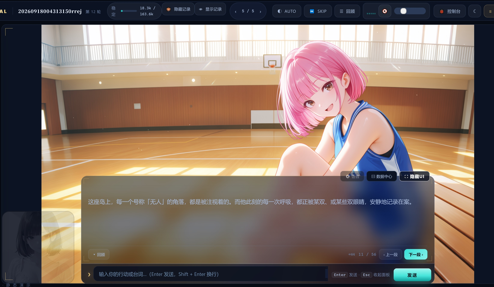

# AI-GAL

**AI-GAL** 是一个完全本地运行的 AI 角色扮演 / 视觉小说（Galgame）引擎。
用 SillyTavern 生态的角色卡驱动多角色剧情：主 AI 写故事，管家 AI 负责格式切分与氛围分析，
画师 AI 撰写生图提示词，默认由 **anima-turbo-cg**（极简本地生图，解压即用）生成立绘与 CG，
也可改用 **ComfyUI + 自备工作流** 换取更高画质，
支持 TTS 语音朗读、MVU 变量系统、世界书、多存档管理与移动端自适应界面。

后端 Node.js + Express + SQLite（better-sqlite3），前端为原生 JS 游戏化 UI，无需构建、解压即用。



---

## 一、功能特性

### 角色扮演与剧情
- **SillyTavern 兼容角色卡**：支持 `.json` 与 PNG 内嵌卡导入；内置角色卡优化助手（格式规范 / 去重合并）
- **三个 AI 分工流水线**：主 AI 生成剧情（### story / dialog / status / actions 分段），管家 AI 完成
  氛围（mood）分析、行动选项生成、记忆摘要、生图触发判断，画师 AI 撰写生图提示词（详见第二节）
- **世界书**：关键词 / 常驻 / 关闭三种激活模式，见 `WORLDBOOK_ACTIVATION_GUIDE.md`
- **界面与操作说明**：主界面、菜单、各项设置怎么用、注意事项，见 `操作说明.md`
- **MVU 变量系统（完整支持）**：原生 MVU 卡的 `_.set` / `_.add` / `_.assign` / `_.remove` 命令由引擎**真实执行**，
  `[值, 描述]` 语义、`$meta` 结构约束与模板、`[InitVar]` 初始化、
  数学表达式求值全部支持；变量逐层快照存在存档的 `mvu/` 目录，**数据中心 → 世界状态**可查看分类变量、本轮变更与被拒绝的操作。
  旧的 `<json_patch>`（RFC 6902）与 SAM `<UpdateVariables>` 写法继续兼容。
- **STscript 兼容**：脚本命令与脚本变量（全局 / 会话级）
- **记忆代理**：每轮生成一句记忆摘要，累计后自动整理成表格注入上下文，长对话不丢剧情
- **行动判定（后台掷骰，默认开启）**：行动选项自带**成功率**，由你选择；点下去后**先由后台代码掷骰裁定成败**，
  再把判定结果作为「既定事实」交给 AI 写剧情——成败不再由 AI 自己说了算。
  D100 制（1-100）：**1-3 大失败、96-100 大成功**；其余按选项给出的成功率判定；
  选项未标成功率时按默认档 **75%**（与手动输入同档）。
  每轮选项里**至少有一项是「绿色行动」（成功率 ≥80%）**，保证总有一条稳妥的路。
  **你手动输入的行动按 75% 加成判定**。判定结果会落库，重新生成**不会重掷**。
  剧情处于 **NSFW 场景**期间**整套判定暂停**（不掷骰、不注入成败），退出该场景后自动恢复。
  如果 AI 写出了与判定相反的结果，本轮会被**驳回重写一次**（可关）。
  骰值不在主界面显示（保持沉浸感）——想看真实点数请开幕后控制台。详见 `操作说明.md` 第六节。

### 视觉与音频
- **自动生图**：角色立绘（portrait）、剧情 CG、角色登场 CG、头像；
  提示词标签按双层结构（Hard Tags + 自然语言）自动组合。
  **anima-turbo-cg 是极简模式**（默认，单模型、无 Python / 无 torch / 无 ComfyUI，解压即用，只有基本的生图功能，适用于不会使用comfyui的初级用户）；
  **若需要更好的图像质量，建议安装 ComfyUI 并配置自己的工作流**（见第六节 2）
- **自动视频生成（生图的辅助）**：由管家 AI 按你在**设置 → 视频生成**里填的条件（例如「NSFW场景」）
  判定是否出片，走 ComfyUI 通路，产物进存档的视频画廊；
  桌面端在对话框右侧有与头像框对称的视频小窗，移动端是左上悬浮按钮点开播放，视频同样进 CG 画廊（首帧）
- **TTS 语音朗读**：支持火山引擎、阿里百炼、SiliconFlow、Volink 等云端 API 格式，
  以及 ComfyUI Qwen3-TTS（`qwen3-tts-01.json`）本地推理
- **BGM 氛围联动**：按管家 AI 判定的 mood（battle / blue / ceremony / nomal / relaxed / suspense）自动切歌，
  仓库自带 15 首曲目（12 首 CC-BY 4.0 + 3 首自制 / AI 生成），开箱即用
- **主题系统**：内置多套主题 + 自定义 CSS 变量

### 存档与界面
- **master/sub 存档架构**：按角色分文件夹，存档内含事件日志、角色名册、CG 画廊、生成图片
- **多端界面**：桌面全屏 VN 演出界面 + 手机 / 平板移动端（自动识别跳转，可用 `?desktop=1` 切回）
- **局域网游玩**：`Start-LAN.bat` 启动后，同一网络下的手机可直接访问，有专门的移动前端。（注意安全风险）

---

## 二、AI 分工与模型选择

本项目把「写故事」与「结构化杂活」拆给三个**可独立配置**的 AI（在 **设置 → API 供应商** 里各选各的），
三者可以指向完全不同的服务商与模型：

| 角色 | 负责什么 | 模型建议 |
| --- | --- | --- |
| **主 AI** | 生成剧情正文：`### story` / `dialog` / `status` / `actions` 分段、对白、旁白、行动选项文本。**唯一决定文笔与剧情质量**的环节 | **越强越好** —— 优先用你可用范围内最高档的大模型 |
| **管家 AI** | 格式切分与结构化产出：氛围 mood 判定、行动选项生成、记忆摘要、生图触发判断、变量补丁整理 | 廉价的 flash / 小模型，或本地小模型即可 |
| **画师 AI** | 把剧情转成生图提示词（双层结构 Hard Tags + 自然语言），决定立绘 / CG 的画面描述 | 同上，廉价模型或本地模型即可 |

**为什么可以这么省**：管家与画师做的是「结构化抽取 / 改写」——输出短、判据明确、容错高，小模型足以胜任；
而主 AI 的输出会直接成为你读到的正文，值得把预算都花在它身上。

### 关于缓存命中（成本优化）

- **主 AI 的请求针对前缀缓存（prefix / prompt cache）命中做了专门优化**：
  - 动态注入内容（记忆表格、参考资料、后置指令、已有画像角色等）**不写进历史消息**，而是集中放在
    尾部一条独立消息里，使 `[系统提示词 + 完整历史]` 保持**逐字节稳定**，跨轮次持续复用服务端缓存；
  - `### summarize` 段落会从历史中剥离（改由记忆 / 事件日志单独注入），避免重复 token 撑大前缀、
    拉低前缀缓存命中率。
  - 效果：主 AI 的长上下文成本与首字延迟显著下降（以按缓存命中计费的服务最明显）。

### 长期记忆：记忆表格的注入时机

剧情摘要（**记忆表格**）**每轮都会写入存档的 `event_log.md`**，但**平时并不进入上下文** ——
只有每到设定轮次（默认第 20、40、60… 轮）才把**累积至今的完整表格注入一次**，
注入后一直保留，直到下一次注入替换。这样既让早期剧情不会随对话增长而丢失，
又不必每轮重复发送整张表。

- 历史消息**完整保留**（不做滑动窗口裁剪）；只有玩家显式选择「忽略之前的对话」时，
  才会把更早的对话移出上下文，并**保留第 M 轮对话 + 完整记忆表格 + 一段固定格式说明**。
  该操作**只影响送模型的上下文，不删除任何消息**，可随时撤销。
- 轮次按**用户发言数**计数，因此开场白会被并入第 1 轮的总结，不会出现「第 1 轮缺失」。
  轮次编号**不受 `/hide` 隐藏、也不受「忽略之前的对话」影响**：第 N 轮永远是第 N 次用户发言。
  这两者只减少送进模型的内容，不改编号、不删消息，所以正文里的轮次与记忆表格的轮次始终一致。
- 注入间隔 N 与忽略提示轮次 M（M 为 N 的整数倍）均可在 **设置 → 记忆表格** 调整；
  数据中心的记忆表格有**三色灯**标示每轮是「已登记 / 已注入 / 内容缺失」。

- **管家 AI 与画师 AI 没有做这类优化**：它们的提示词按轮次现场拼装、内容变化大，缓存收益本就有限，
  因此不必为这两个位置付「缓存友好」的溢价。
- 实践建议：主 AI 尽量选择**支持前缀缓存计费**的服务商，并**固定模型**——频繁切换模型会让缓存整体失效。

### 本地推理与显存提醒

本地 LLM、本地生图（anima-turbo-cg 或 ComfyUI）与本地 TTS（Qwen3-TTS）**都会占用大量显存**，
三者同时开启会互相挤占，表现为排队、超时或生成失败。请根据自己的**显存容量与实际需求**合理启用：

- 显存有限时，优先把 **LLM 换成云端 API**（主 AI 尤其推荐云端强模型），本地只保留生图或 TTS 其中一项；
- **anima-turbo-cg 是独立的服务进程**（不是本项目的子进程），它自己占一份显存（1024² 约 3.5 GB）；
  不玩的时候用它的 `stop.bat` 关掉即可释放；
- ComfyUI 的模型精度 / 分辨率 / 并发数、TTS 的采样参数都会显著影响占用，可按需下调；
- 云端 TTS（火山引擎 / 阿里百炼 / SiliconFlow / Volink 等）不占本地显存，是省显存的替代方案。

---

## 三、与 SillyTavern 的关系

### 兼容性（可以直接搬过来的东西）

- **角色卡**：直接导入 SillyTavern 的 `.json` 卡与 **PNG 内嵌卡**，兼容 V1 / V2 格式与常见字段映射；
- **世界书**：`character_book` 条目、关键词 / 常驻 / 关闭三种激活模式，见 `WORLDBOOK_ACTIVATION_GUIDE.md`；
- **STscript**：脚本命令与脚本变量（全局 / 会话级）；
- **MVU 变量**：原生 `<UpdateVariable>` + `_.set(...)` 命令**真实执行**（含 VWD、`$meta`、`[InitVar]`）；`<json_patch>`（RFC 6902）、SAM `<UpdateVariables>`、`<SAMCheckpoint>` 同样支持；
- **提示词字段**：系统提示词、历史后置指令、对话示例、`creator_notes` 等照常生效；
- **API 预设**：导入 / 导出 SillyTavern 的聊天补全预设（字段名与 ST 完全一致，可直接被 ST 导入），
  导出时自动带上当前 API 供应商（源 / 地址 / 模型）；出于安全考虑**不包含 API Key**。

### 与 SillyTavern 的区别和优势

| | SillyTavern | AI-GAL |
| --- | --- | --- |
| 形态 | 聊天式前端，以对话为主 | **游戏化 VN 引擎**：全屏立绘舞台、逐段演出、对话框、HUD |
| 生图 / TTS | 依赖扩展与外部服务逐个接线 | **内建流水线**：立绘 / 剧情 CG / 登场 CG / 头像自动生成并归档，TTS 朗读、BGM 氛围联动 |
| AI 编排 | 单一主模型兼顾一切 | **三 AI 分工**（主 / 管家 / 画师），主模型只专注写故事，杂活交给廉价模型 |
| 上下文成本 | 由扩展自行拼装 | 主 AI 侧**前缀缓存命中优化**（见第二节），长对话更省、更快 |
| 存档 | 聊天记录 + 扩展数据 | **master / sub 存档架构**：按角色分文件夹，含事件日志、角色名册、CG 画廊、生成图片 |
| 运行方式 | 依赖前端宿主与扩展生态 | 单进程 Node + SQLite + 自带 `runtime/node.exe`，**解压即用、无需扩展** |
| 界面 | 桌面为主 | 桌面全屏 VN + 移动端 / 平板自适应（局域网可直连手机） |

简言之：**卡还是那些卡，但从「聊天窗口」变成了「能自动配图、配音、配乐的视觉小说」**。

### 卡片选择建议（重要）

- **强烈建议使用纯文字卡**：世界观 + 角色设定 + 开场白这类卡效果最稳，管家 / 画师流水线能充分发挥。
- **轻前端卡不保证实现效果**：卡内自带 HTML / JS 界面、按钮、面板等前端逻辑的卡，本项目**不会执行卡内前端脚本**，
  只按自己的 VN 外壳渲染 —— 这类卡导入后可能缺少交互元素，或表现与原前端不一致。
- **MVU 变量：已完整支持**（v1.1.0 起）。原生 MVU 卡的变量**由引擎真实执行**，不再只是「识别与展示」：
  - 支持 `_.set` / `_.add` / `_.assign` / `_.remove`（以及 `_.insert` / `_.unset` / `_.delete` / `_.move` 别名）全部命令；
  - 支持 `[值, 描述]`（VWD）语义 —— 直接赋值只改值、**描述不会丢**；
  - 支持 `$meta` 结构约束（`extensible` / `required` / `recursiveExtensible` / `template`）
    与 `strictSet` / `strictTemplate` / `concatTemplateArray` 全局开关；**越权增删会被拒绝**，而不是静默把数据结构写坏；
  - 支持 `[InitVar]` 世界书初始化与开场白 `<initvar>` 覆盖；
  - 变量值支持数学表达式（mathjs）：`_.set('好感度', 10, 10 + 2)` 会算出 12，而不是存成字符串；
  - 完整**逐层快照**写入存档的 `mvu/` 目录 —— 藏楼层 / 删楼层 / 切 swipe 都不会让变量错乱。
  - 详见下节 [MVU 变量系统](#mvu-变量系统)。

- **卡内前端脚本仍不执行**（唯一保留的限制）：卡自带 HTML / JS 界面、按钮、面板不会运行，我们只按自己的 VN 外壳渲染。
  但**变量本身**（包括脚本驱动的条件判定、跨系统状态机所依赖的数据）由服务端按 MVU 规范真实计算，
  所以依赖变量数值的玩法可以正常工作。

> 一句话总结：**纯文字卡 + 强主 AI** 是体验最好的组合；**MVU 变量卡现在可以放心用**（变量由引擎真实执行），
> 只有「卡内自带 HTML/JS 界面」这类重前端卡仍需先小范围试玩。

---

## 四、MVU 变量系统

AI-GAL **完整实现了 [MagVarUpdate (MVU)](https://github.com/MagicalAstrogy/MagVarUpdate) 的变量语义** ——
原生 MVU 卡输出的变量命令会被引擎**真实执行**，而不是当文本显示。

### 支持的命令

| 命令 | 作用 |
| --- | --- |
| `_.set(路径, 新值)` / `_.set(路径, 旧值, 新值)` | 赋值（对 `[值, 描述]` 只改值、**保留描述**） |
| `_.add(路径, 增量)` | 数值增减（AI 不必自己算新旧值，**根除算错数**） |
| `_.assign(路径, 值)` / `_.assign(路径, 键或下标, 值)` | 往数组 / 对象插入 |
| `_.remove(路径)` / `_.remove(路径, 键或下标或值)` | 删除变量 / 数组项 / 对象键 |
| `_.insert` / `_.unset` / `_.delete` / `_.move` | 上述命令的别名 |

同时兼容旧写法：`<json_patch>`（RFC 6902）、SAM 的 `<UpdateVariables>`（SQL 方言）、`<SAMCheckpoint>`。

### 三个容易踩坑、但已正确处理的地方

1. **`[值, 描述]` 二元组不会被写坏**
   MVU 卡里常见 `"生命": [20, "受到伤害时减少"]`。直接 `_.set('生命', 14)` **只改数值、描述保留**；
   要整体替换得显式写下标。

2. **复合值要用 `[0]` 定位**
   ```javascript
   // 正确：定位到"值"本身
   _.set('福建.舰载机[0].补给中.J-35', 8, 9);
   ```

3. **结构受 `$meta` 保护，越权增删会被拒绝**
   卡作者可在 `[InitVar]` 里声明 `extensible` / `required` / `template` 等约束。
   违规操作会被**明确拒绝并记录**（在数据中心能看到原因），而不是把数据结构悄悄写坏。

### 初始化

- 世界书里名为 **`[InitVar]`** 的条目（**可以处于关闭状态**）会被解析为初始变量；多条目深合并。
- 开场白里的 `<initvar>` 块会**覆盖**世界书初值（用于"不同开局不同初始值"）。
- 初始化按世界书**记账**，同一本书不会重复初始化，**已有进度不会被覆盖**。

### 变量存在哪 / 怎么看

变量以**逐层完整快照**存在存档目录下（与 `event_log.md` 同级）：

```
saves/gameNNNN/<存档>/
  event_log.md          ← 记忆表格
  mvu/
    state.json          ← 当前变量（喂给 AI 的权威值）
    rounds/0001.json    ← 每一轮的完整快照
    rounds/0002.json
```

因为读的是"上一层那条消息的快照"，所以**藏楼层、删楼层、切 swipe 都不会让变量错乱**。

**界面**：打开 **数据中心 → 世界状态**，可以看到

- 按语义分组的变量（世界 / 资产 / 数值 / 角色等标签页），值可直接编辑；
- **本轮变更** —— 这一轮哪些变量从多少变成了多少；
- **被拒绝的操作** —— 哪些命令因为越权/路径不存在而没生效（排查卡问题时非常有用）。

> **性能说明**：非 MVU 卡**完全不会加载** MVU 模块，也不会有任何额外开销；
> 只有识别为 MVU 卡时引擎才激活。

---

## 五、快速开始

### 环境

- **Windows 无须额外安装任何依赖。** 便携版 Node 22 运行时（`runtime\node.exe`）与全部依赖库
  （`node_modules\`）均已内置，**clone 或解压后双击 `start.bat` 即可运行** ——
  不需要装 Node.js，不需要装 npm，也不需要执行任何安装命令。
- 其他系统：自行安装 Node 22 后执行 `node server/index.js` 亦可。

### 桌面版（安装包，推荐给普通用户）

不想解压一堆文件、也不想碰命令行，就用桌面版安装包（约 190 MB，已包含运行时和全部依赖）：

1. 到 [Releases](https://github.com/zHdna/ai-gal/releases) 下载 `AI-GAL-Setup-x.y.z.exe`；
2. 双击安装。**安装位置可以自己选**；默认装在当前用户目录下，不需要管理员权限；
3. 装完双击桌面上的「AI-GAL」图标就行，会打开一个独立的程序窗口。

目标机器上**不需要安装 Node.js，也不需要任何其它东西**。

| 事项 | 说明 |
| --- | --- |
| 数据在哪里 | 存档、数据库、配置都在 `%APPDATA%\AI-GAL`。托盘图标右键 →「打开数据文件夹」可直达 |
| 端口 | 默认 3210。被别的程序占用时会**自动改用空闲端口**并记住，下次沿用；想手动指定：托盘右键 →「端口与局域网设置…」 |
| 局域网访问 | 默认**关闭**，只监听 `127.0.0.1`（仅本机可访问，最安全）。想让手机 / 平板连上：用开始菜单里的 **「AI-GAL（局域网模式）」** 快捷方式启动 —— 等价于 `AI-GAL.exe --lan`，**只在本次启动生效**，关掉程序即恢复。确实想每次都开，才用托盘右键 →「端口与局域网设置…」勾选（界面会直接列出该用哪个地址） |
| 卸载 | 卸载**不会删除**存档和配置；要彻底清干净需手动删掉 `%APPDATA%\AI-GAL` |
| 首次运行提示 | 安装包未做代码签名，SmartScreen 可能提示「Windows 已保护你的电脑」，点「更多信息」→「仍要运行」即可 |
| 生图 | 与绿色版相同，`anima-turbo-cg` 仍需单独启动（见下方说明） |

### 启动（绿色版 / 从源码运行）

| 方式 | 操作 | 地址 |
| --- | --- | --- |
| 本机（推荐） | 双击 `start.bat` | http://127.0.0.1:3210 |
| 局域网 | 双击 `Start-LAN.bat` | http://<你的IP>:3210 |
| 手动 | `runtime\node.exe server\index.js` | http://127.0.0.1:3210 |

> **想让「生图」开箱可用**：默认生图引擎是 `anima-turbo-cg`，它是**另一个需要单独启动的程序**。
> 请在启动 AI-GAL 之前（或之后）去它的目录双击 `start.bat`。没启动它也能玩，
> 但立绘 / CG 会退回占位图 —— 详见 **第六节「首次配置」第 2 条「生图」**。

### 环境变量

| 变量 | 默认 | 说明 |
| --- | --- | --- |
| `PORT` | `3210` | 监听端口。被占用时服务会自动改用空闲端口 |
| `HOST` | `127.0.0.1` | 监听地址。`0.0.0.0` 表示局域网可访问。优先级：`HOST` > `--lan` 参数 > 配置文件 `allowLan`（桌面版）> 默认仅本机 |

启动参数 `--lan`：等价于把监听地址设为 `0.0.0.0`，**只对本次启动生效、不写配置**。
桌面版的「AI-GAL（局域网模式）」快捷方式就是用它；绿色版也可以
`runtime\node.exe server\index.js --lan`。

> ⚠️ **局域网模式的安全提醒**：开启后同网络内的任何人都能打开界面，包括你的
> API Key 设置与全部聊天记录。请只在可信网络里临时开启，用完关掉。
| `AI_GAL_DATA_DIR` | 见下 | 可写数据（存档 / 数据库 / 生成图片 / 上传）存放目录。桌面版固定为 `%APPDATA%\AI-GAL` |
| `DISABLE_MOBILE_FRONTEND` | 未设置 | 设为 `1` 关闭移动端自动跳转 |
| `CRYPTO_PASSWORD` | 未设置 | API Key 加密口令，**建议设置** |
| `CRYPTO_SALT` | 未设置 | 加密盐，**建议设置** |

**数据目录是怎么定的**：程序目录可写时就写在程序目录里（绿色版的行为，和你之前用的完全一致，
不会产生迁移）；程序目录不可写时（例如装到了 `C:\Program Files`）自动退回 `%APPDATA%\AI-GAL`。
在程序目录放一个名为 `.portable` 的空文件，即可强制「数据跟着程序走」的便携模式。

### 关于依赖（一般无需处理）

`node_modules/` 与便携版 Node 22 运行时**都已随仓库提供**，开箱即用。之所以内置运行时而不用
你自己装的 Node，是因为 `better-sqlite3` 是原生模块、与 Node 大版本绑定 —— 固定运行时版本可以
避免「依赖与 Node 版本不匹配」这类问题。

仅当你需要改代码、或想改用自己安装的 Node 时，才需要在本机装有 Node 22 的前提下重新安装依赖：

```bat
npm install
```

---

## 六、首次配置

### 1. API 供应商（必填）

进入 **设置 → API 供应商**，添加你自己的模型服务：填写名称、`Base URL`、`API Key`、模型名，
类型一般选 `openai` 兼容；保存后在对应功能里选中它作为「主 AI / 管家 AI / 画师 AI / TTS」。

> **模型省钱要点**（详见第二节）：主 AI 用最强模型，管家 AI 与画师 AI 用廉价 flash 模型或本地小模型即可；
> 主 AI 已针对前缀缓存命中优化，建议选按缓存命中计费的服务商并固定模型。

> 本版本**预置供应商为空**，需要自行添加。
> 你的 Key 会以 AES-256-GCM 加密存入本地数据库，不会上传任何远端。

**加密说明**：加密口令来自 `CRYPTO_PASSWORD` / `CRYPTO_SALT` 环境变量；未设置时会在
`server/db/.crypto_secret` 生成一个本机随机密钥（该数据库连同 `.crypto_secret` 一起拷走仍可解密，
只拷 `data.db` 则不能）。长期使用建议显式设置环境变量。

### 2. 生图（默认 anima-turbo-cg 极简模式；追求画质请上 ComfyUI）

**生图不是可有可无的装饰，而是演出机制的核心**：角色立绘、剧情 CG、角色登场 CG、
头像全部由它生成并归档进存档（CG 画廊与角色名册都依赖这些产物）。不配置生图时只能退回占位图与默认头像，
「视觉小说」的观感会大幅下降 —— 所以请务必把生图跑起来。

本项目的**默认生图引擎是 `anima-turbo-cg`**（极简模式，开箱默认选中、参数已填好）。

> 📦 **anima-turbo-cg 是独立项目，需要单独下载并运行**：仓库地址
> **<https://github.com/zHdna/anima-turbo-cg>**
> 代码与文档在仓库里；**模型与后端包以 zip 形式放在该仓库的 Releases** 中
> （六个 zip：模型三件套约 3.05 GiB + 后端包 16 MB ~ 852 MB，合计约 3.93 GiB），
> 请到那里下载，它不在本仓库内。解压方式见该项目的 README「获取与安装」。
>
> ⚠️ 本仓库只负责「按 anima-turbo-cg 的接口去调用它」，**不会自动把它启动起来**。
> **没有启动它时，生图会失败**（日志里是连接被拒绝）—— 此时请先启动它，或改用 ComfyUI。

#### 路线 A：anima-turbo-cg —— 极简模式（默认，推荐先跑通）

**定位：够用、零依赖、几分钟就能跑起来。它是「极简模式」，不是画质天花板。**

| 特点 | 说明 |
| --- | --- |
| 体积 | 约 **4.7 GB**（模型 3.5 GB + 三套后端包 1.24 GB），对比 ComfyUI 方案约 11 GB |
| 依赖 | **无 Python、无 torch、无 ComfyUI**，内核是 `stable-diffusion.cpp`，解压即用 |
| 硬件 | NVIDIA 显卡（可用 CUDA 后端）、AMD / Intel 显卡（Vulkan）**以及纯 CPU** 都能跑 |
| 出图 | 1024² / 6 步下 GPU 单张**只需几秒**，纯 CPU 约 4~5 分钟；风格为二次元·2.5D |
| 代价 | 单模型、无 ControlNet / LoRA / 精修链，**细节与可控性明显不如 ComfyUI 工作流** |

**使用步骤**：

1. **下载 anima-turbo-cg**：到 <https://github.com/zHdna/anima-turbo-cg> 取代码与文档，
   再从其 **Releases** 下载模型与后端包 zip（解压位置见该项目 README 的「获取与安装」），
   组成完整的 `anima-turbo-cg\` 目录（与 AI-GAL 并列存放即可，二者互不依赖路径）；
2. 双击它的 **`start.bat`**：自检模型 → 探测后端 → 预热 → 服务起在 `http://127.0.0.1:8100/`；
   看到 `[ok] server ready` 就是好了。**关掉那个黑窗口即停止服务**，不会在后台占用显存。
3. 回到 AI-GAL：**设置 → 生图 → 生成引擎** 选 **「anima-turbo-cg（极简本地生图·默认）」**。
   端点是内置默认值，正常情况下**什么都不用改**，直接保存即可：

   | 项 | 默认值 |
   | --- | --- |
   | 引擎 | `anima-turbo-cg` |
   | API 地址 | `http://127.0.0.1:8100/v1/images/generations` |
   | API Key | `local`（该服务不校验 Key，填任意非空值） |
   | 生图模型 | `sd-cpp-local` |
   | 图片尺寸 | `1024x1024` |

   想确认连通性，点一下旁边的**「拉取」**按钮：能列出 `sd-cpp-local` 就说明接上了。

> **纯 CPU 用户请注意**：anima-turbo-cg 收到请求后是**同步出图**的，
> 1024² 在 CPU 上要约 4~5 分钟。请把「图片尺寸」改成 **512x512 或 768x768**（512² 约 1 分钟）。
> AI-GAL 对 anima 引擎的等待上限是 10 分钟，够用；但小尺寸仍然是纯 CPU 上更舒服的选择。

> **提示词建议**：anima-turbo 是蒸馏模型，**英文标签式**效果最稳，例如
> `1girl, solo, portrait, masterpiece, best quality, detailed eyes, cinematic lighting`。
> 中文也能识别（文本编码器是多语言的），但**别写** `photorealistic, raw photo` 这类写实词 ——
> 它是二次元 / 2.5D 取向，写实前缀反而出塑料感。步数 / CFG 由 anima-turbo-cg 自己的
> `config.json` 决定（官方推荐 **6 步 / CFG 1.0**），AI-GAL 不发送这些字段。

#### 路线 B：ComfyUI —— 想要更好的图像质量，就用它

**anima-turbo-cg 是极简模式；如果你在意画质、想要 LoRA / ControlNet / 自定义采样链，
请安装 ComfyUI 并使用自己的工作流。** 这是本项目画质的上限所在，也是唯一能自由换模型、换工作流的路线。

1. 在「设置 → 生图」把 **生成引擎** 改为 **「ComfyUI（画质最佳·需工作流）」**；
2. 填写 ComfyUI 地址（默认 `http://127.0.0.1:8188`）；
3. **提供工作流 JSON**：根目录的 `GALCG.json`（CG）与 `portrait_x.json`（立绘）默认是**空占位文件**，
   需要把自己 ComfyUI 里导出的工作流（API 格式 JSON）写入这两个文件，
   或在设置里填写自己工作流文件的名字（放在项目根目录）；
4. 工作流引用的模型需在你的 ComfyUI `models/` 目录中已存在；提示词节点会自动探测，无需手动填节点 ID。

> 📌 **两个引擎可以随时切换**，设置里选哪个就是哪个（`生成引擎` 下拉框），互不影响。
> 切换后请点「保存图像设置」。
>
> ⚠️ 两种引擎在设置里是**两套独立的地址**：anima-turbo-cg 用 `API 地址`（8100），
> ComfyUI 用 `ComfyUI 服务器地址`（8188）—— 端口不同，别填串了。

> **线上生图 API（可选择，但未测试）**：设置里的模式也支持填写 `openai` 兼容或 `stability` 格式的
> **线上生图 API**（填 `api_url` / `api_key` / 模型名即可调用）。但该路径**尚未经过测试**，
> 效果、稳定性与标签兼容性均不做保证；想要完整体验（尤其立绘与登场 CG 的一致性），
> 请使用 anima-turbo-cg 或 ComfyUI。

> **关于超时**：AI-GAL 对 `openai` / `stability` 这类**线上接口**的超时是 120 秒。
> anima-turbo-cg 走独立分支，等待上限是 **10 分钟**，不受此限制。

#### 提示词模式（Tag / Anima 两层 / 纯自然语言）

设置 → 生图 → **提示词模式**，三档按底模选：

| 模式 | 提示词形态 | 适用底模 |
| --- | --- | --- |
| 关键词Tag模式 | danbooru 关键词标签 | SD / Pony / Illustrious 等标签驱动模型 |
| Anima两层模式 | Hard Tags 行 + 空行 + 英文自然语言层 | Anima 等混合提示词模型 |
| 纯自然语言模式 | 整段英文自然语言，**不含任何标签** | **z-image / Krea2 / Qwen-Image 2.1** 等写实底模 |

> **写实底模请选「纯自然语言模式」**：这类模型看到 `1girl, solo, huge_breasts` 这类标签串会画成
> 2.5D 插画。该模式下由**代码先抽标签、再由画师 AI 改写成自然语言描述**后才出图；
> 立绘、CG、角色登场 CG、NSFW 结束空镜全部适用。详见「十、更新记录」。

#### 生图排错（最快自查路径）

| 现象 | 原因与处理 |
| --- | --- |
| 日志 `ECONNREFUSED 127.0.0.1:8100` | **anima-turbo-cg 没启动**。去它的目录双击 `start.bat`，等出现 `[ok] server ready` |
| 日志 `EPROTO` / TLS 相关错误 | 引擎选成了 `openai`，但地址填的是 `http://127.0.0.1:8100`。**把引擎改回 `anima-turbo-cg`** |
| 日志 `端口 8100 ...` / 生图全部失败但服务在跑 | 端口被别的程序占用；关掉冲突程序，或改 anima-turbo-cg 的 `config.json` 端口并在 AI-GAL 里同步改 `API 地址` |
| 出图很慢 / 卡住 | 纯 CPU：把「图片尺寸」改成 `512x512` 或 `768x768`；GPU 首张图慢是着色器编译，属正常 |
| 画质差：过曝 / 发黄 / 塑料感 | anima-turbo-cg 的 **CFG 被调高了**，改回 `1.0`（改它的 `config.json`，或直接用它的 WebUI 改） |
| 画面空洞、细节少 | 提示词太短；补上 主体 + 画质词 + 光影，步数用 6 |
| 每次出图都一样 | anima-turbo-cg 的 `config.json` 里 `params.seed` 必须是 `-1`（随机） |
| 立绘 / CG 一致性差、想要更好画质 | 这是极简模式的固有上限 —— **改用 ComfyUI + 自己的工作流**（路线 B） |
| 切换引擎后设置没生效 | 引擎下拉框改完必须点「保存图像设置」；两个引擎的地址字段是分开的 |


### 3. TTS 语音（可选）

在「设置 → TTS」添加供应商：支持火山引擎、阿里百炼、SiliconFlow、Volink 等云端 API 格式
（使用云端服务需自备对应平台的 Key），以及 ComfyUI Qwen3-TTS 本地推理（工作流文件 `qwen3-tts-01.json`，
需在 ComfyUI 中安装 FL_Qwen3TTS 相关节点）。

### 4. BGM 背景音乐（已内置）

仓库自带 **15 首背景音乐**：12 首 **CC-BY 4.0** 授权曲目（作者 Kevin MacLeod / incompetech.com）
+ 3 首作者自制 / AI 生成曲目，按管家 AI 判定的情绪自动切歌，无需配置。
曲目清单与许可说明见 [`BGM/CREDITS.md`](BGM/CREDITS.md)：

| 目录 | 情绪 |
| --- | --- |
| `BGM/battle/` | 战斗 |
| `BGM/blue/` | 忧郁 |
| `BGM/ceremony/` | 仪式 |
| `BGM/nomal/` | 日常 |
| `BGM/relaxed/` | 放松 |
| `BGM/suspense/` | 悬念 |

替换曲目时把 mp3 放入对应目录即可，注意**文件名不要包含空格**（服务端路由限制），如 `mybgm01.mp3`。

---

## 七、目录结构

```
AI-GAL/
├─ start.bat / Start-LAN.bat      启动脚本
├─ package.json / package-lock.json
├─ README.md                      本文件
├─ game01.jpg                     README 演示截图
├─ WORLDBOOK_ACTIVATION_GUIDE.md 世界书激活机制说明（用户文档）
├─ 操作说明.md                    界面与操作说明：主界面 / 菜单 / 设置 / 注意事项（用户文档）
├─ GALCG.json                     默认 CG 工作流（空占位，仅 ComfyUI 模式需要）
├─ portrait_x.json                默认立绘工作流（空占位，仅 ComfyUI 模式需要）
├─ qwen3-tts-01.json              ComfyUI Qwen3-TTS 工作流（可选功能）
├─ runtime/node.exe               自带 Node 运行时（便携版 Node 22）
├─ node_modules/                  依赖库（随仓库分发，开箱即用）
├─ server/                        后端
│  ├─ index.js                    入口 / 路由挂载
│  ├─ paths.js                    只读程序目录 / 可写数据目录的唯一真相来源
│  ├─ desktop-config.js           桌面版可配置项（端口，存在数据目录里）
│  ├─ crypto.js                   API Key 加解密
│  ├─ savePaths.js                master/sub 存档目录架构
│  ├─ db/init.js                  数据库建表与迁移
│  ├─ mvu.js                      MVU 卡识别与提示词模块（按卡的类型分别处理）
│  ├─ mvu/                        MVU 变量引擎（命令执行 / schema / 初始化 / 存档快照）
│  ├─ routes/                     各功能路由（chat / images / tts / saves …）
│  ├─ utils/                      工具（jsonpatch / nameMatch / pathGuard …）
│  └─ data/anime-character-names.json   动漫角色英文名对照表
├─ desktop/                       桌面版（Electron 外壳）源码
│  ├─ main.js                     窗口 / 托盘 / 子进程编排
│  ├─ settings.html               端口设置界面
│  ├─ preload-settings.js         设置窗口的 preload
│  └─ electron-builder.yml        打包配置（NSIS 安装包）
├─ public/                        前端
│  ├─ index.html                  桌面 VN 界面
│  ├─ mobile.html                 移动端界面
│  ├─ css/                        样式（ai-gal-redesign / style / theater-enhance / desktop / mobile）
│  ├─ js/                         前端脚本（app.js 与 desktop / mobile 外壳）
│  └─ logo.png / home.jpeg         图标与默认背景图
├─ BGM/                           背景音乐（15 首曲目，见 BGM/CREDITS.md）
├─ tools/                         构建 / 调试脚本
└─ data/                          运行时数据（TTS 队列等）
```

运行后生成（已加入 `.gitignore`，**请勿分享**）：

> 下列路径都是相对**数据目录**而言的。绿色版的数据目录就是程序目录本身；
> 桌面版（安装包）与「装到不可写位置」的情况，数据目录是 `%APPDATA%\AI-GAL`，
> 因此实际位置是 `%APPDATA%\AI-GAL\saves\`、`%APPDATA%\AI-GAL\server\db\data.db` 等等。

| 路径 | 内容 |
| --- | --- |
| `server/db/data.db` | 数据库（供应商 Key、角色卡、会话记录） |
| `server/db/.crypto_secret` | 本机加密密钥，**泄露等于泄露 Key** |
| `saves/` | 存档、存档内图片，以及 MVU 变量快照（`saves/<存档>/mvu/`） |
| `data/generated_images/` | 生成的图片 |
| `data/tts-cache/` | TTS 音频缓存 |
| `public/uploads/` | 上传的头像 / 角色图 |
| `profile/` | 角色 / NPC 立绘 |

---

## 八、隐私与分享须知

分享本目录前，请务必清理以下内容（或确认其为空）：

- `server/db/data.db` 与 `server/db/.crypto_secret` —— 含 API Key 与聊天记录
- `saves/`、`data/generated_images/`、`data/tts-cache/`、`public/uploads/`、`profile/`
- 任何 `*.log` / `*.out` 文件（可能含本机绝对路径）

一键检查（PowerShell）：

```powershell
Get-ChildItem -Recurse -File -Force |
  Where-Object { $_.FullName -notmatch '\\node_modules\\' } |
  Select-String -Pattern 'sk-[A-Za-z0-9_\-]{16,}|api_key|[A-Za-z]:\\' -List |
  Select-Object Path
```

---

## 九、声明

- 本项目以 **MIT** 许可证开源，见 [LICENSE](LICENSE)。
- 本项目含 AI 生成内容，用户对于 AI 生成的内容须自行负责。
- 内置背景音乐：Kevin MacLeod 的 12 首曲目以 **CC-BY 4.0** 授权使用，另有 3 首作者自制 / AI 生成曲目；
  作者与曲目清单见 [`BGM/CREDITS.md`](BGM/CREDITS.md)。
- 请遵守你所在地区的法律法规，以及你所调用的各模型服务商的条款；
  使用者需自行对其生成与存储的内容负责。

---

## 十、更新记录

### v1.1.3 — 累积更新 9：视频生成 + 判定手感调整（NSFW 场景停判）

> 本版把两批改动合在一起：**视频生成**（此前只存在于源码仓库，从未出过安装包）与
> **判定手感调整**（大失败收窄 / 默认档上调 / NSFW 期间停判）。

**视频生成（生图的辅助）**

- **剧情里可以直接出短视频**：由管家 AI 判定 —— 你在 **设置 → 视频生成** 填一句话 X（例如「NSFW场景」），
  系统把它包装成「当 X 时，调用视频生成接口」交给管家，管家认为本轮满足条件就触发一次视频生成，
  并写出该镜头的【英文】提示词（描述动作/运镜，不是一张静图）。
- **走 ComfyUI 通路**（沿用生图那套引擎设置）：任务即发即忘，等待上限默认 30 分钟；
  产物进存档的视频画廊，可查可删。
- **提示词与图片同一套规范**：图片与视频共用同一份加工（名册外貌拼接 → 模式化组装 → 纯自然语言第二趟）；
  同一回合既出图又出视频时，**视频直接套用生图那份提示词**，不再另生成一套。
- **前端**：桌面端在对话框右侧多一个**与头像框对称**的视频小窗（折叠 / 放大为背景 / 弹出悬浮窗 + 恢复 / 全屏，
  带暂停与音量）；移动端不做小窗，改成**左上角悬浮按钮**，点开弹出播放。
  两端都有**「重画视频」**按钮 —— 与「重画 CG」不同，视频是**追加新条目**而不是覆盖，
  提示词取画廊里那条的原文、前缀由服务端重新拼接（改了前缀再重画会生效）。
  **视频也会进 CG 画廊**（显示首帧，点击进灯箱播放）；关掉开关就完全不显示。

**判定手感调整**

- **大失败由 1-5 收窄为 1-3**：原先每 20 次就有一次大失败，体感偏挫败；
  现在只有掷出 **1、2、3** 才是大失败（3%）。大成功区间不变（96-100，5%）。
- **默认档由 50% 上调为 75%**，与「你手动输入的行动」**同档** ——
  选项漏标成功率不再等于把这件事变难。
- **每轮至少保留一项「绿色行动」**：2-4 个选项里**必定至少有一项成功率 ≥ 80%**（绿灯）。
  主 AI 会被要求留一条稳妥、低风险的路；万一整轮都给了高风险选项，
  管家补全时会把**最稳妥的那一项**提到 80~95%（只调这一项，其余不动）。
  **代码不会偷偷改 AI 给出的成功率**（成功率是 AI 对难度的判断，改了就成骗玩家）。
- **NSFW 场景期间暂停判定**：剧情进入 NSFW 场景后，行动选项**不再掷骰、不再注入成败结果**
  （避免 H 场景被"行动失败 / 大失败"莫名打断）；**退出该场景后自动恢复**判定。
  生图开与关都生效（判据是服务端落库的剧情状态，与生图流程无关）。

### v1.1.2 — 累积更新 8：后台掷骰判定 + 行动选项末尾的成功率灯

> **这是累积版**：v1.1.1 的内容（后台掷骰判定、纯自然语言生图、回顾删除改为按轮截断、
> 端口避让后打开正确地址等）此前**只推送了源码仓库、没有出桌面安装包** ——
> v1.1.2 是它们的**第一份桌面版**。相比 v1.1.0 桌面版，本版累积的全部内容就是下面这一整节。
>
> **v1.1.2 新增**：行动选项末尾的**成功率灯**（见下方「其它」第一条）。

**核心：把「行动成不成功」的决定权从 AI 手里收回到代码。**

以前 AI 自己在正文里决定你的行动是否得手，于是会出现「明明该成功的行动被写成失败」这类
不可控情况。现在改为：**代码掷骰裁定 → 结果作为既定事实交给 AI → AI 只负责把结果演成剧情。**

**判定规则**

| 骰值 | 有成功率时 | 无成功率时（默认档） | 手动输入（75% 档） |
| --- | --- | --- | --- |
| **96–100** | **大成功** | **大成功** | **大成功** |
| **1–3** | **大失败** | **大失败** | **大失败** |
| 4–95 | 点数 ≥（101 − 成功率）→ 成功 | 点数 ≥ 26 成功（75%） | 点数 ≥ 26 成功（75%） |

- 骰制为 **D100（1-100）**。大成功 / 大失败区间**绝对优先**：
  即使成功率 95%，掷出 1-3 依然大失败；成功率 5% 掷出 96-100 依然大成功。
- 成功率与骰点区间**一一对应**：75% = 26-100 成功（75 个点），10% = 91-100 成功（10 个点）。
- 成功率取值范围 5–95（自动夹取），避免出现「必定成功 / 必定失败」。

**成功率由谁给**

1. **主 AI** 在选项行尾标注：`--1、悄悄撬开窗户潜入【成功率 65%】`（写法漂移也能识别：
   全角/半角括号、有无冒号、行尾裸百分比都兼容）
2. 主 AI 漏写时由**管家 AI 补全**（提示词已强制要求每项都带）
3. 两者都没写 → **默认档**（**75%**，点数 ≥ 26 成功 —— 与手动输入同档）
4. 你不点选项、**自己手打行动** → **75% 加成档**（等于对选项不满意、要自己作行动，给点照顾）

**防止 AI「假判定」**

判定结果以「系统已裁定、不得更改」的措辞注入，并明确禁止「虽然……但是失败了」这类架空写法。
开启**违背判定驳回重写**（默认开启）后，程序会扫描正文，命中高置信度的否定措辞就**驳回重写一次**，
仍违背则放行（不会卡死）。该开关可在 **设置 → 玩法规则** 里关闭。

**其它**

- **开关**：设置 → 玩法规则 → 「Roll 点判定」，**默认开启**；关掉后流程与以前完全一致。
- **选项末尾的成功率灯**：每个行动选项按钮的末尾有一颗小圆点，颜色就是它的成功率档位
  （**绿 ≥80% · 金 ≥60% · 橙 ≥40% · 红 <40%**），与聊天区的 % 徽章**同一套配色**。
  桌面端、移动端、聊天区三处都有，点下去之前扫一眼颜色就知道这项大概好不好办。
  选项**没标成功率就不亮灯**（不瞎猜一个颜色）；关掉 Roll 点时灯与 % 徽章一起消失。
- **骰值可见性**：主界面只显示成败（如「◆ 大成功！」「✕ 行动失败」），保持沉浸感；
  **幕后控制台**能看到该轮的真实骰值、成功率、判定线与来源（想核对 AI 有没有骗你时用）。
- **重新生成不重掷**：判定结果随发言一起落库，重生成同一个选项不会「这次成功下次失败」。
- **第 1 轮对话不判定**：开场白之后的**首次发言**不做成功率判定。
  因为开场白里的"选项"常常是设定类/启动类操作（选角色、确认设定、填初始信息…），
  对它们掷骰裁定成败没有意义，抽到大失败还会把开局写歪。**从第 2 轮起正常判定。**
- 判定只写在发言记录里，**不新增消息行**，轮次编号不受影响。

**本版新增：生图提示词支持「纯自然语言描述」（z-image / Krea2 / Qwen-Image 2.1 等写实底模）**

- **提示词模式由两档拆成三档**（设置 → 生图 → 提示词模式）：
  `关键词Tag模式`（SD / Pony / Illustrious 等标签驱动模型）·
  `Anima两层模式`（Hard Tags 行 + 空行 + 英文自然语言层）·
  `纯自然语言模式`（整段英文自然语言，**一个标签都不出现**）。
- 选**纯自然语言模式**后：代码先**抽取并拼接标签**（人数 / 性别 / 种族 / 外观 / 服装 / 动作 / 道具 /
  场景锚点 / 安全分级），再由**画师 AI 第二趟**把标签包改写成纯英文自然语言描述，然后才发起生图请求。
- **为什么需要它**：z-image、Krea2、Qwen-Image 2.1 这类写实底模看到 danbooru 标签串会画成 2.5D 插画。
  实测（同一底模 + 同一场景，只改提示词写法）：**标签串出动漫，纯散文出照片**。
- **四条路径全部生效**：立绘 / 剧情 CG / 角色登场 CG / NSFW 结束空镜。纯模式下不再注入
  `nsfw`、`1girl`、`(1boy:1.3)`、年龄等标签；画家第二趟失败会自动退回自然语言层，不会挡住出图。
- **旧配置无感迁移**：库里原来的 `natural` 会自动按 `anima`（Anima 两层）处理，效果与升级前一致。
- 同时修正：ComfyUI 的 **steps / cfg / 采样器 / 调度器 / 分辨率完全由工作流决定**
  （应用不再用自定义参数覆盖，只随机种子）；提示词注入现在能识别 `TextEncodeQwenImage21` 的 `prompt` 字段
  （此前被写进不存在的 `text` 字段，ComfyUI 静默忽略、一直沿用工作流里烘焙的旧提示词）。
**本版修正（同日补丁，版本号不变）**

- **修正成功率判定**：骰制由 D20 改为 **D100**，判定方式改为「点数够高即成功」——
  原先存在两处错误：① 用 20 面的点数去和百分比（如 75）直接比较，条件恒真；
  ② 行动选项自身的成功率没有传到判定环节，导致无论选哪个选项都按同一个（75%）计算。
  现已修正：**1-5 大失败、96-100 大成功，其余按「点数 ≥ 101 − 成功率」判定**
  （大失败区间后来在 v1.1.3 收窄为 **1-3**，见上），
  实测各档成功率与标称值一致（如 75% 档实测 74.98%）。详见 `操作说明.md` 第六节。
- **修正端口自动避让后打开错误页面**：当默认端口 3210 被占用时，程序会自动改用 3211 及之后的端口，
  但此前启动器仍按写死的 3210 打开浏览器，导致页面打不开或连到旧实例。
  现改由服务端用**实际监听的端口**打开浏览器。
- **修正卡片工坊（Card Studio）请求**：向本地 llama.cpp 系服务发请求时未带 `Content-Length`，
  会被判为分块请求而返回 400。已补上该请求头。
- **「回顾」里的删除改为「从该轮起截断」**：以前点删除只删掉单条消息，会留下"半轮"
  （一轮 = 玩家发言 + AI 回复两条），而且界面上的轮次编号不会跟着更新，
  记忆表格也仍显示已删除的轮次。现在改为：**删掉第 N 轮及其之后的全部内容**
  （含记忆表格对应行），于是下次发言正好回到第 N 轮。删除前会弹确认框写明影响范围。
  **该功能桌面版与移动端一致**（移动端「回顾」同样按轮次分组，每轮轮头有 🗑 删除）。

### v1.1.0 — MVU 变量完整支持

**核心：MVU 变量从「只能识别与展示」升级为「引擎真实执行」。**

- **完整命令支持**：`_.set` / `_.add` / `_.assign` / `_.remove` 及 `_.insert` / `_.unset` / `_.delete` / `_.move`。
  以前原生 MVU 卡的主要输出方式**根本无法生效**（只认旧式 `<json_patch>`），现在会真正改写变量。
- **`[值, 描述]`（VWD）语义**：赋值只改值、描述保留，不再把卡精心设计的变更条件写没。
- **`$meta` 结构保护**：`extensible` / `required` / `recursiveExtensible` / `template` 全部生效；
  越权的新增与删除会被**拒绝并给出原因**，而不是静默破坏数据结构。
- **`[InitVar]` 初始化**：世界书条目 + 开场白 `<initvar>` 覆盖，按世界书记账、不重复初始化、不覆盖已有进度。
- **数学表达式求值**（mathjs）：`_.set('好感度', 10, 10 + 2)` 得到 12，而不是字符串 `10 + 2`。
- **逐层完整快照**：变量存在存档的 `mvu/` 目录（`state.json` + `rounds/NNNN.json`），
  藏楼层 / 删楼层 / 切 swipe 都不会让变量错乱；变量随存档一起复制、导出、删除。
- **提示词按卡的类型分别处理**：原生 MVU 卡**不再被要求改用 `<json_patch>`** ——
  以前模型的提示词里同时存在两套互相冲突的格式要求，会导致变量时灵时不灵。
- **非 MVU 卡完全不加载 MVU 模块**，零额外开销，行为与以前完全一致。

**界面**

- **数据中心 → 世界状态** 成为变量的唯一入口：语义分组标签页、可直接编辑的字段，
  以及新增的 **本轮变更** 与 **被拒绝的操作** 两个板块（后者能直接回答"为什么这轮没生效"）。
- 变量块**不再出现在主对话窗口**（以前会以原文形式显示，或被折叠展示）。

**修复**

- **变量块泄漏到正文**：原生 MVU 卡经常不写包裹标签、直接把 `_.set(...)` 写在正文里，
  加上流式路径的处理顺序问题，导致命令原文被显示甚至入库。已修复（含缺闭合标签、代码块包裹、裸命令三种情况）。
- **生成多张图后头像变默认头像**：缩略图生成是同步阻塞的（单张 40~75ms，
  而头像实际是 1~2MB 的 PNG），一轮生成多张时请求排队到浏览器超时。
  现在头像**落盘即预热缩略图**（实测首请求从 59.7ms 降到 0.43ms，**139×**），
  并给头像加了**失败自动重试**（3 次，2s / 4s / 8s）。
- 世界书「触发间隔（4 轮冷却）」此前实际**完全没生效**，已修复。
- `/hide` 忽略楼层不再影响轮次编号，正文与记忆表格的轮次始终一致。

### v1.0.9 及更早

- **v1.0.9**：Volink 音色情绪档映射（换音色表达情绪）；移动端设置弹窗与桌面端对齐；弹窗提示条层级与配色修复。
- **v1.0.8**：图片缩略图子系统（自写 PNG 编解码）、舞台内存优化、Volink 559 音色。
- **v1.0.7**：卡坊（Card Studio）上线、上下文占用比例显示。
- **v1.0.6**：生图尺寸按引擎分离、CG 画廊实时刷新。

